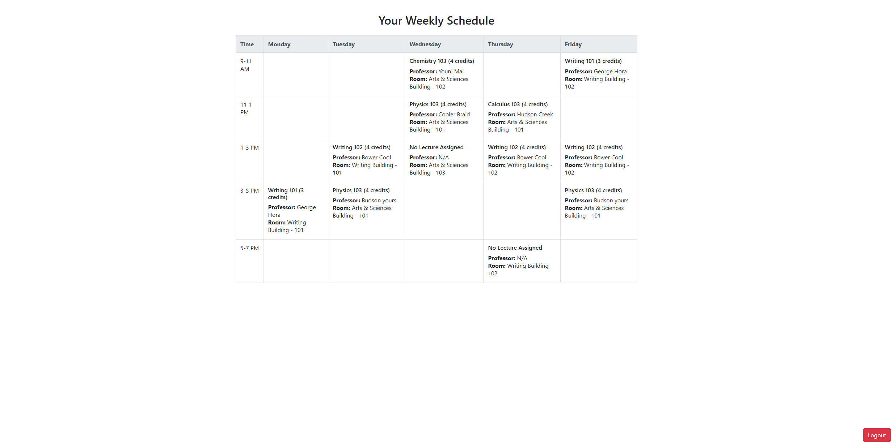

#  Class Management Dashboard

A web-app that lets universities manage lecture halls, timetables, students and user roles


## Preview




---

## How It Works 

**Tech used:** Java 21; Servlet 6 (Jakarta EE 10), JSP + JSTL, Bootstrap, MySQL

* **MVC stack** – Servlets act as controllers (`/controller/*`), with models in (`/model/*`), JSPs render the views (`/WEB-INF/views/*`)
* **DAO layer** – every entity (`Lecture`, `LectureHall`, `Student`, `User`) has a DAO with prepared-statement CRUD
* **Role-based UX** –  
  * **Admin:** add halls, create lectures, assign students, view lists & dashboards
  * **Student:** log in and see personalised schedule

---

## Features

* Easy to use dashboard to assign halls and students
* Search bars everywhere in preperation for large sets
* Clean Table for the student to view 


---


## Getting Started

```bash
# 1 – Clone
git clone https://github.com/YourUser/ClassManagementSystem.git
cd ClassManagementSystem

# 2 – DB setup look for table_manager.sql
# creates a database called class_management

# 3 – Update DB creds
in src/main/java/com/.../util/DatabaseUtil.java  set USER / PASSWORD

# 4 – Build
mvn clean package

# 5 – Deploy
#  Run

# 6 – Browse
open http://localhost:8080/ClassManagementSystem
